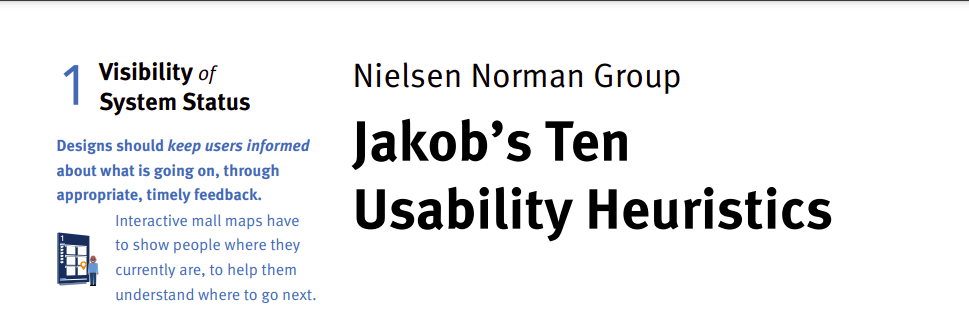
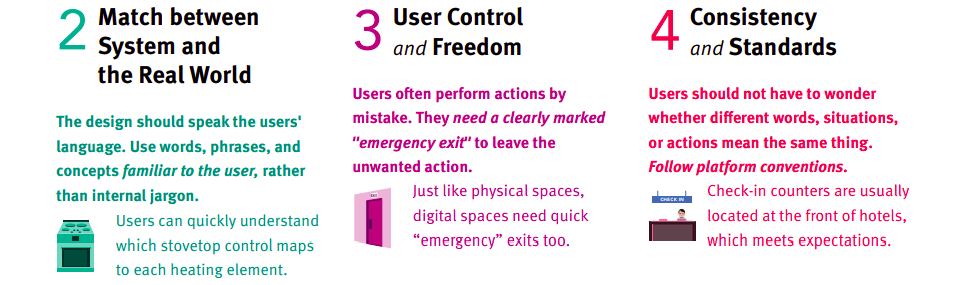
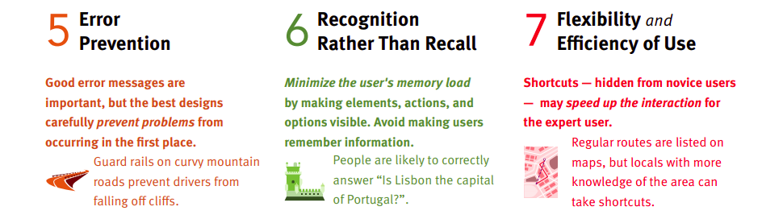
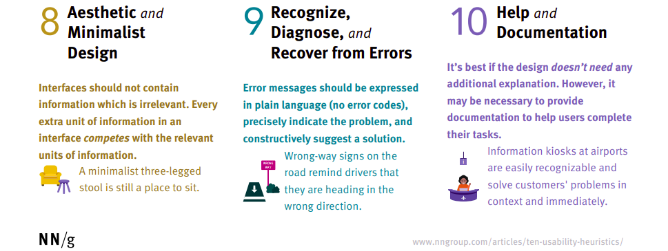
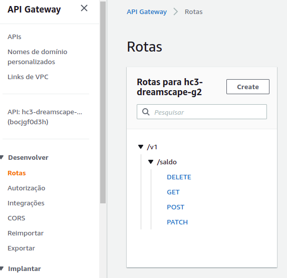
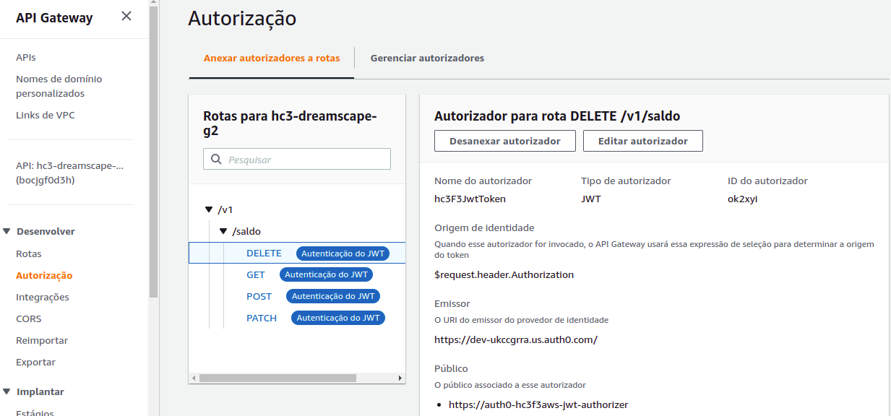
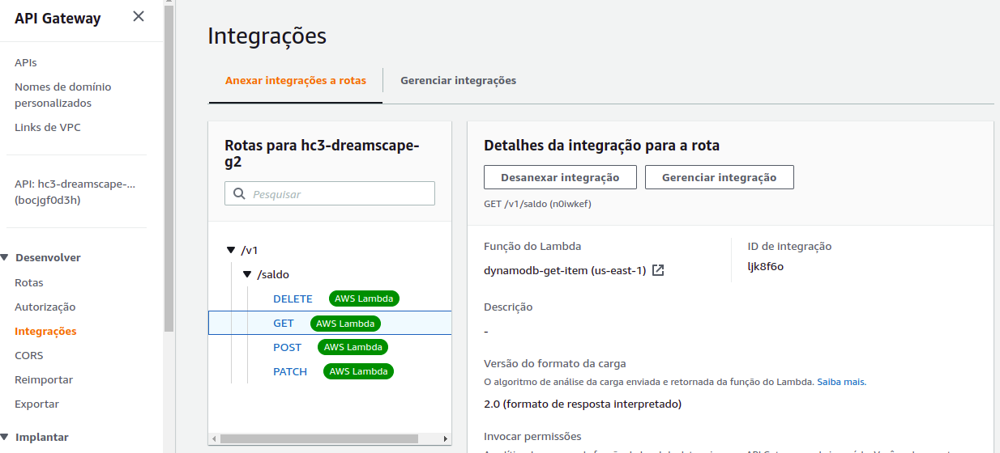
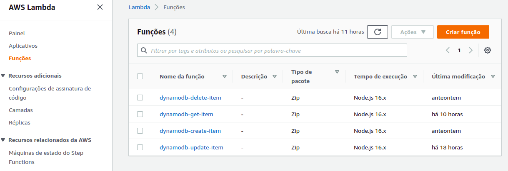

   

# Apresentação

Este repositório é parte do bootcamp ["Hiring Coders #3"](https://www.hiringcoders.com.br/).
Este projeto entrega uma loja funcional com sistema de recompensa implementado, cumprindo o desafio da semifinal da Fase 3.

## Equipe

- Alberto Victor Rebello
- Arthur Candido
- Ciro Carvalho de Jesus
- Victor Cesar Evangelista

## Tecnologias e Ferramentas

## Lista de pastas

A master branch tem a versão funcional do código do projeto. Ele está separado em pastas e sua descrição resumida encontra-se abaixo:

| Folder       | Description                             |
| ------------ | --------------------------------------- |
| Backend AWS  | Virtual Wallet APP                      |
| Backend VTEX | Orders Feed APP                         |
| FRONTEND     | Posterium Theme APP + Point Counter APP |
| IMAGES       | Imagens relacionadas ao readme file.    |

## Instruções de uso
  ### Faça login em sua conta vtex e crie um workspace de desenvolvimento, então:
-  **Abra um terminal e rode os seguintes comandos:**
-   `git clone https://github.com/AlbertoVictorRebello/hiring-coders-fase3-dreamscape-grupo2.git`
-   `cd hiring-coders-fase3-dreamscape-grupo2`
-   `cd frontend/point-counter/`
-   `vtex setup`
-   `vtex link`

-   **Abra um segundo terminal em ./hiring-coders-fase3-dreamscape-grupo2**
-   `cd backend-vtex/orders-feed/`
-   `vtex setup`
-   `vtex link`
 
 - **Configure sua workspace para receber informações dos pedidos gerados**
 - O backend da aplicação utiliza como sensor do evento de compras a aplicação própria da vtex "orders-broadcast". Essa aplicação precisa ser configurada no adm de sua loja. Para isso siga instruções desse link: [# Receiving Order Notifications](https://developers.vtex.com/vtex-developer-docs/docs/how-to-receive-order-notifications-on-vtex-io)
   
 -   **Abra um terceiro terminal em ./hiring-coders-fase3-dreamscape-grupo2**
-   `cd frontend/posterium-theme/`
-   `vtex setup`
-   `vtex link`
Ao terminar esse processo, você receberá no terminal um endereço de acesso para a loja em funcionamento.

## Jornada do Consumidor
A loja desenvolvida na VTEX busca oferecer a melhor experiência e usabilidade para que o consumidor encontre com facilidade os produtos que atendem a sua necessidade. Conheça os princípios que são a base de nosso desenvolvimento.

Layouts intuitivos, seu consumidor vai aonde ele quiser!

   

Lojas bem arrumadas. Organização vende mais!

   

E se algo der errado? Consertamos para que não se repita!

   

Melhoramos o ambiente de loja ouvindo sempre nosso o  Consumidor.

   

## Descrição do Desafio

Data de Abertura do Projeto: 13-Jul-2022

Data Limite de Execução do Projeto: 19-Jul-2022

Data Limite de Push Final do Projeto no Github: 20-Jul-2022

### Escopo do Projeto:

O objetivo central do projeto é o de implementar um modelo de recompensa na loja da Maria.

Estão incluídos no escopo os seguintes itens:

- Desenvolver uma Frente de Loja (Store Front) com interface simples para garantir uma boa experiência ao Consumidor.
  - A compra deve ser realizada via interface.
  - O Consumidor deve se registrar e ter uma senha.
- Desenvolver as funcionalidades para reconhecer a criação de um novo pedido e processar as combinações de compra.
- Desenvolver uma Carteira Virtual para cada Consumidor.
- Desenvolver um Contador De Pontos para validação do saldo de cada Consumidor.
  - o contador deve estar visível ao Consumidor.
  - escutar Criação de Ordem/Pedido (Broadcast) para gerar recompensa de 1 ponto para cada R$ 1,00 gasto pelo Consumidor.
  - os centavos podem ser descartados. Ex: R$ 35,23 geram 35 pontos.
  - os pontos são incrementados por cada compra e deduzida via chamada de API;
- Desenvolver uma API para consultar o saldo.
  - "Pegar o saldo, onde traz o valor inteiro do saldo atual."
- Desenvolver uma API para debitar um valor.
  - "Debitar valor inteiro do saldo, retornando o valor atual."
- Desenvolver um forte Backend montado na AWS para alavancar a funcionalidade, onde pode ser utilizado quaisquer serviços desejados.
- Desenvolver o sistema de armazenamento para manter os dados. Sugestões:
  - https://developers.vtex.com/vtex-rest-api/reference/master-data-api-v2-overview
  - https://aws.amazon.com/s3/
  - https://aws.amazon.com/dynamodb/
  - O grupo pode escolher livremente a ferramenta para manter os dados.

### Ferramentas
- Usar loja compartilhada com um ou mais Workspaces para trabalhar.
- Usar toolbelt da VTEX.
- Usar seu editor de textos preferido.

### Entrega:

- Projeto no Repositório Github do grupo.
  - Contemplando o fluxo completo desde a experiência do usuário até a interpretação do lojista da compra.
  - O workspace deve estar funcional com SKUs e processando compra.
- Garanta uma apresentação elegante.

### Critérios de Avaliação:

- Organização de tarefas;
- Página com funcionalidade de compra;
- Exibir contador de pontos no front-end;
- Utilizar API da VTEX;
- Páginas responsivas;
- Validação de campos obrigatos em formulários.
- Senhas criptografadas (requisito retirado do desafio).

### Não estão incluídos no escopo os seguintes itens:

- Criar sistema no qual o usuário final pode utilizar os pontos gerados.
- Debito de pontos devido à cancelamentos de compra.
- Implementar data de expiração de pontos.
- Medição da loja usando ferramentas verificação de performance."

## Atividades Realizadas e programadas para V2.0

[Lista de Atividades](https://github.com/AlbertoVictorRebello/hiring-coders-fase3-dreamscape-grupo2/blob/master/images/Dreamscape%20Grupo%202%20-%20Atividades.pdf)

### Primeiro passo

Dividir tarefas entre os integrantes do time.

## Backend AWS

AWS Api Gateway + AWS Lambda Functions + AWS DynamoDB + Auth0

- Os vídeos abaixo serão úteis para o processo de:
  - Criação do backend com AWS Api Gateway + AWS Lambda Functions + AWS DynamoDB
  - Inclusão de camada de segurança usando o provedor Auth0

- API Gateway ‘hc3-dreamscape-g2’:
  - Configurar as rotas conforme abaixo:

 

  - Configurar as autorizações das rotas conforme abaixo:

 

- Configurar as integrações conforme abaixo:

 

 - Em CORS, configurar Access-Control-Allow-Origin com ‘*’.

- Criar as Lambda Functions conforme abaixo:

 

- Para cada lambda function, criar as seguintes variáveis de ambiente:
 - TABLE		carteira-virtual 
 -  DEBUG	true

- Configurar o acesso ao DynamoDB em permissões.

- Criar as integrações em API Gateway conforme abaixo:

 

- Incluir a camada de segurança usando o provedor Auth0.

- Veja abaixo as instruções de como configurar o Postman, ou outra ferramenta de sua escolha, para testar a api:

- Criar uma tabela no DynamoDB com 
aws-dynamodb-table

- Consultar Auth0 para atualizar o Token:
  - Método: 
    - POST
  - URL:
    - https://dev-ukccgrra.us.auth0.com/oauth/token
  - Body:
    - {"client_id":"nfJZyeojvUawCMUX5hoHlx0MkckUh9Ml","client_secret":"B2OfmdO8JQl29fcYVPsYctVgF--LhS2rR1Rvcq-31P7K0e2KtZDiwyqQ-FgJ5c81","audience":"https://auth0-hc3f3aws-jwt-authorizer","grant_type":"client_credentials"}

- Criar um registro:
  - Método:
     - POST
  - URL:
    - https://bocjgf0d3h.execute-api.us-east-1.amazonaws.com/v1/saldo
  - Authorization:
    - Bearer Auth0 Token
  - Body:
    - {     
      "email": usuario1@users.com",
      "saldo": 0
}

- Consultar todos os registros:
  - Método:
    - GET
  - URL:
    - https://bocjgf0d3h.execute-api.us-east-1.amazonaws.com/v1/saldo
  - Authorization:
    - Bearer Auth0 Token

- Consultar um registro por email (getByEmail):
  - Método:
    - GET
  - URL:
    - https://bocjgf0d3h.execute-api.us-east-1.amazonaws.com/v1/saldo/usuario1@users.com
  - Authorization:
    - Bearer Auth0 Token  

- Atualizar o saldo de um registro (updateByEmail):
  - Método:
    - PATCH
  - URL:
    - https://bocjgf0d3h.execute-api.us-east-1.amazonaws.com/v1/saldo
  - Authorization:
    - Bearer Auth0 Token
  - Body:
    - {"email": "usuario1@users.com",
      "pontos": 50
}
  - Response:
    - {
    "updated_at": "2022-07-19T19:54:03.324Z",
    "created_at": "2022-07-19T19:35:14.478Z",
    "email": "usuario1@users.com",
    "saldo": 50
}

- Excluir um registro por email:
  - Método:
     - DELETE
  - URL:
    - https://bocjgf0d3h.execute-api.us-east-1.amazonaws.com/v1/saldo
  - Authorization:
    - Bearer Auth0 Token
  - Body:
    - {"email": usuario1@users.com"
}

 
